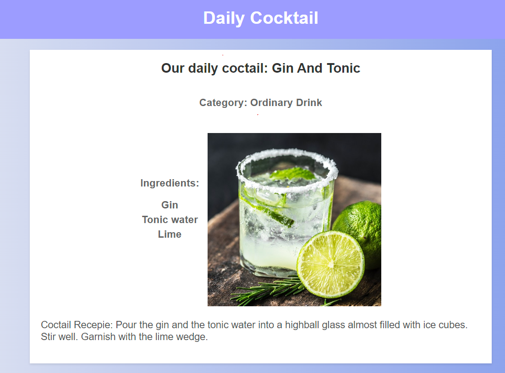

# Daily Cocktail App




Welcome to the Daily Cocktail App! This application displays a randomly selected cocktail each day, fetched from the Cocktail DB API. It's built using Express.js for the server, EJS for templating, and Axios for API requests.

## Introduction

The Daily Cocktail App is a simple web application that fetches a random cocktail from the Cocktail DB API and displays its name, category, ingredients, and instructions. It's a fun way to discover new cocktails every day.

## Installation

To get started with the Daily Cocktail App, follow these steps:

1. Clone the repository:
    ```sh
    git clone https://github.com/ilayEldar24/daily-cocktail
    ```
2. Navigate to the project directory:
    ```sh
    cd daily-cocktail
    ```
3. Install the dependencies:
    ```sh
    npm i
    ```
4. Start the server
  ```sh
    nodemon index.js
```

## Dependencies

The Daily Cocktail App uses the following dependencies:

- [Express](https://expressjs.com/): A minimal and flexible Node.js web application framework.
- [Axios](https://axios-http.com/): A promise-based HTTP client for the browser and Node.js.
- [Body-Parser](https://www.npmjs.com/package/body-parser): Node.js body parsing middleware.
- [EJS](https://ejs.co/): A simple templating language that lets you generate HTML markup with plain JavaScript.
- [Path](https://nodejs.org/api/path.html): A Node.js module for handling and transforming file paths.

## Configuration

No additional configuration is required for this project. However, you can modify the server port if needed. By default, the server runs on port 3000. To change the port, edit the following line in the `index.js` file:

```javascript
const port = 3000; // Change this to your desired port number
```

Feel free to customize the README further to fit your project's specific needs. Happy coding!
